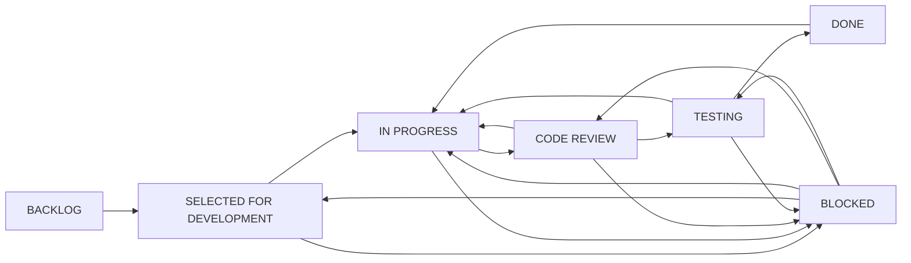

# Workflow, Definition of Ready và Definition of Done — CTP

## 1. Workflow



| Status | Category Jira | Điều kiện |
| --- | --- | --- |
| BACKLOG | To Do | Chưa cam kết; có nội dung để refine. Tất cả issue import khởi đầu ở đây. |
| SELECTED FOR DEVELOPMENT | To Do | Được chọn vào sprint; AC/DoR rõ. Prerequisite có thể cùng sprint nhưng phải xong trước khi bắt đầu. |
| IN PROGRESS | In Progress | Người thực hiện bắt đầu; blocker bắt buộc đã DONE hoặc đầu vào đã được nghiệm thu. |
| CODE REVIEW | In Progress | Phần thực hiện sẵn sàng; self-review diff/checklist cho đồ án một người. |
| TESTING | In Progress | Đã review; chạy tests/manual checks theo AC và lưu bằng chứng. |
| BLOCKED | In Progress | Có trở ngại thực sự: dependency chưa đáp ứng khi cần làm, môi trường/tài khoản hoặc lỗi không xử lý tiếp được. |
| DONE | Done | AC + DoD đạt, có bằng chứng; thiết lập Resolution=Done. |


- Review yêu cầu sửa hoặc test thất bại có thể trả IN PROGRESS. Không đưa mọi test fail vào BLOCKED nếu có thể sửa ngay.
- BLOCKED ghi lý do, key blocker/đầu vào, hành động tiếp theo, ngày kiểm tra lại và trạng thái trước khi bị chặn.
- Khi gỡ blocker, quay lại trạng thái phù hợp; không nhảy trực tiếp DONE.
- Reopen DONE → IN PROGRESS phải xóa Resolution và ghi lý do.
- Jira workflow này độc lập với state machine booking PENDING/CONFIRMED/... trong ứng dụng.
- Bug chỉ tạo khi có lỗi thật; không tạo hàng loạt Bug giả để lấp sprint.

## 2. Definition of Ready

- Summary và Description nêu rõ mục tiêu, actor/đối tượng và ranh giới.
- Acceptance Criteria kiểm chứng được, không chỉ “hoạt động tốt”.
- Story có SP trong 1, 2, 3, 5, 8; không có Story >8. Epic/Sub-task SP trống.
- Dependency tồn tại, không vòng lặp; cùng sprint có thứ tự làm rõ.
- Component, labels, priority, Scope và Planned Sprint đúng.
- Đầu vào/API/schema đã có hoặc được hoàn thành trước trong sprint; credentials dùng qua env, không đưa vào issue.
- Sub-task đủ nhỏ để theo dõi; tách tiếp nếu vượt một ngày làm việc.
- Nếu thay đổi đặc tả, cập nhật các Story, test và tài liệu liên quan trước khi thực hiện.

## 3. DoD chung

1. Công việc thuộc scope hoàn thành; với task code, code/build/static checks không lỗi.
2. Acceptance Criteria đạt; test liên quan pass và kiểm tra thủ công có bằng chứng.
3. Validation và authorization/ownership được kiểm tra khi áp dụng.
4. Không hardcode hoặc lộ secret trong source, bundle, logs, docs hay issue.
5. Swagger/OpenAPI cập nhật khi API thay đổi.
6. Migration/schema/seed cập nhật khi DB thay đổi.
7. README/tài liệu/sơ đồ cập nhật khi cần.
8. Self-review hoàn tất; không còn lỗi Highest/High trong phạm vi chưa giải quyết.
9. Story chỉ DONE khi tất cả Sub-task và AC của Story đạt.
10. Epic chỉ DONE khi toàn bộ children đạt; Epic còn Post-MVP không cản nghiệm thu release MVP-1.0 nhưng không được đánh dấu DONE giả.

Không yêu cầu tạo code ứng dụng cho task chỉ viết tài liệu. Mục không áp dụng phải ghi **N/A + lý do**; không ghi “pass” cho test/build chưa chạy.

## 4. Profile DoD

### DEV

- Phạm vi triển khai hoàn thành; build/static checks liên quan không lỗi.
- Test phù hợp và kiểm tra thủ công có bằng chứng; validation, authorization/ownership được kiểm tra nếu áp dụng.
- Không hardcode secret; Swagger cập nhật nếu đổi API; migration cập nhật nếu đổi DB; README/docs cập nhật nếu cần.
- Self-review diff/checklist đã làm; acceptance criteria đạt; không còn lỗi Highest/High liên quan chưa xử lý.

### QA

- Kịch bản, fixture và bằng chứng kiểm thử hoàn thành; môi trường/phiên bản và lệnh tái hiện được ghi rõ.
- Các case trong phạm vi pass; lỗi phát hiện có issue/liên kết và retest; build liên quan không lỗi.
- Các tiêu chí validation, authorization, secret, Swagger, migration và docs được kiểm tra theo phạm vi; N/A phải có lý do.
- Kiểm tra thủ công hoàn thành; không dùng mock/in-memory để kết luận concurrency MySQL đạt.

### DOC

- Nội dung đúng đặc tả và bản triển khai tương ứng; sơ đồ/bảng/link đọc được và không mâu thuẫn.
- Hướng dẫn/command/ví dụ được kiểm tra thủ công khi có thể; nguồn và giới hạn được ghi rõ.
- Không có secret; các thay đổi API/DB trong tài liệu khớp Swagger/migration; không yêu cầu viết code ứng dụng cho task tài liệu.
- Self-review hoàn tất; tiêu chí build/test/validation/authorization không áp dụng được ghi N/A kèm lý do, không ghi pass giả.

### INFRA

- Cấu hình/artefact hạ tầng hoàn thành và tái lập được; env mẫu không chứa secret thật.
- Kết nối/build/health/migration hoặc smoke test tương ứng pass, có bằng chứng và kiểm tra thủ công.
- Target môi trường được xác minh; không làm mất dữ liệu ngoài phạm vi; có hướng dẫn chẩn đoán/khôi phục phù hợp.
- Swagger/migration/README cập nhật khi liên quan; authorization/validation không áp dụng phải ghi lý do.

### EPIC

- Scope và children đầy đủ; không ghi SP riêng để tránh cộng trùng.
- Các children đều DONE và mục tiêu Epic được nghiệm thu.
- Có liên kết bằng chứng và tài liệu tổng hợp.
- Nếu còn Post-MVP, giữ Epic mở; release lọc theo Scope/Fix Version của Story.

## 5. Checklist bắt buộc theo rủi ro nghiệp vụ

- Availability/booking: MySQL thật, nhiều kết nối, lock ordering, rollback, retry giới hạn; không thay bằng SQLite để chứng minh concurrency.
- Hold: PENDING chỉ chiếm chỗ khi expires_at > DB UTC clock; đúng thời điểm hết hạn phải được loại dù cron chưa chạy.
- Time: DATE không trôi ngày; xét cả start/end local date; dịch vụ kết thúc ngày sau checkout bị từ chối trong combined booking.
- State: actor/ownership đúng; completed_at chỉ ghi một lần; không nhận status tùy ý từ client.
- Approval: không gate toàn nhóm household bằng APPROVED; hộ mất duyệt được xử lý đơn cũ đúng policy, nhưng user BLOCKED không có ngoại lệ.
- Slot: OPEN/CLOSED, unique thời gian, không booked_quantity; đóng slot không hủy booking cũ.
- Money: ledger amount dương, RECEIPT/REFUND, idempotency replay/hash, chống overpayment/over-refund và cache status cùng transaction.
- Stats: thực tế COMPLETED theo completed_at; dự kiến CONFIRMED; không nhân khách/tiền do JOIN items.
- Secrets: Cloudinary secret chỉ backend; upload kiểm tra quyền; env sample không chứa credential.
- Demo: dùng đơn tương lai cho create/confirm và fixture đã kết thúc cho complete/review; không bỏ rule thời gian.

## 6. Mẫu bằng chứng khi chuyển TESTING → DONE

```text
Issue kế hoạch / Jira key thật:
Phiên bản / commit / môi trường:
AC đã kiểm tra:
Lệnh build/test và kết quả:
Manual scenario + kết quả:
Swagger/migration/docs đã cập nhật:
N/A và lý do (nếu có):
Bug liên quan / kết quả retest:
Self-review:
```

Mỗi Story nhận điểm một lần khi DONE; không cộng thêm điểm Epic hoặc Sub-task. Sau Sprint 1–2 dùng số liệu thực tế để hiệu chỉnh phần chưa làm, không thay điểm cũ để làm đẹp velocity.
