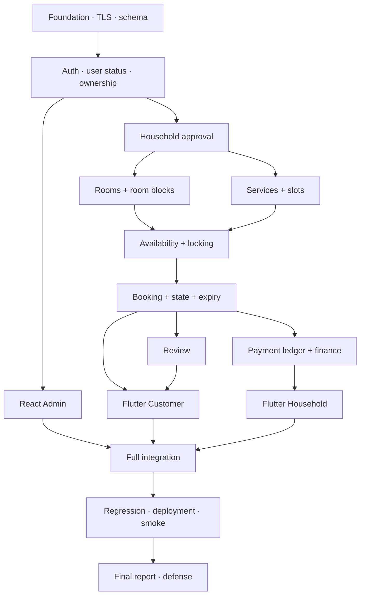

# Dependencies, critical path và rủi ro — CTP

Dependencies là quan hệ **phải hoàn thành trước**, khác Parent là quan hệ phân rã. Key CTP-* là mã kế hoạch. Có 170 cạnh giữa Story và 413 cạnh giữa toàn bộ issue; không dùng Epic tổng làm blocker vì có thể chứa Post-MVP.

## 1. Sơ đồ các nhánh chính

## 2. Đường găng kỹ thuật

Chuỗi dưới đây là một đường dài nhất theo DAG dependency và giờ ước lượng Story: **109 giờ**. Đây không phải tổng thời gian dự án: mô hình DAG này chưa tính giới hạn một người, các nhánh độc lập vẫn phải làm; tổng khối lượng MVP là **219 giờ**.

CTP-19 → CTP-20 → CTP-22 → CTP-25 → CTP-26 → CTP-27 → CTP-30 → CTP-37 → CTP-39 → CTP-40 → CTP-41 → CTP-45 → CTP-46 → CTP-51 → CTP-52 → CTP-53 → CTP-66 → CTP-69 → CTP-70 → CTP-74 → CTP-75 → CTP-76 → CTP-77 → CTP-79 → CTP-80 → CTP-81 → CTP-82

| Thứ tự | Key | Story | Sprint | Giờ |
| --- | --- | --- | --- | --- |
| 1 | CTP-19 | Dựng monorepo, Express và môi trường phát triển | 1 | 4 |
| 2 | CTP-20 | Kiểm chứng Prisma–Aiven TLS và kết nối từ Render | 1 | 5 |
| 3 | CTP-22 | Tạo schema, migration và seed nền tảng MVP | 1 | 4 |
| 4 | CTP-25 | Đăng ký, đăng nhập và JWT cho ba vai trò | 1 | 4 |
| 5 | CTP-26 | Kiểm tra user hiện hành, role, ownership và khóa tài khoản | 1 | 4 |
| 6 | CTP-27 | Quản lý hồ sơ, duyệt và thu hồi duyệt hộ | 2 | 4 |
| 7 | CTP-30 | Danh mục và CRUD dịch vụ có đơn vị bán | 2 | 3 |
| 8 | CTP-37 | Tạo và quản lý lịch service slot | 3 | 4 |
| 9 | CTP-39 | AvailabilityService tính phòng trống và suất còn lại | 3 | 5 |
| 10 | CTP-40 | Khóa tài nguyên và retry trong Prisma transaction | 3 | 5 |
| 11 | CTP-41 | Đóng/mở slot và thay đổi capacity an toàn | 3 | 2 |
| 12 | CTP-45 | Tạo booking nhiều phòng và nhiều dịch vụ nguyên tử | 4 | 6 |
| 13 | CTP-46 | Chuyển trạng thái đúng actor và hoàn thành đúng một lần | 4 | 5 |
| 14 | CTP-51 | Ghi sổ thu/hoàn tiền thủ công và trạng thái thanh toán | 5 | 4 |
| 15 | CTP-52 | Chống ghi tiền trùng và thu vượt khi đồng thời | 5 | 5 |
| 16 | CTP-53 | Ghi chi phí và API tài chính/thống kê cơ bản | 5 | 4 |
| 17 | CTP-66 | Flutter hộ: dashboard, hồ sơ và trạng thái duyệt | 7 | 3 |
| 18 | CTP-69 | Flutter hộ: xử lý booking đúng quyền và trạng thái | 7 | 4 |
| 19 | CTP-70 | Flutter hộ: ghi nhận thu/hoàn với idempotency | 7 | 4 |
| 20 | CTP-74 | Kiểm thử liên thông khách–hộ–Admin | 7 | 4 |
| 21 | CTP-75 | Đạt cổng chất lượng release và xử lý lỗi chặn demo | 8 | 8 |
| 22 | CTP-76 | Triển khai bản release backend và React | 8 | 3 |
| 23 | CTP-77 | Migration và dữ liệu demo trên môi trường trình diễn | 8 | 2 |
| 24 | CTP-79 | Smoke test bản triển khai và APK | 8 | 2 |
| 25 | CTP-80 | Hoàn thiện README và hướng dẫn chạy/triển khai/sử dụng | 8 | 4 |
| 26 | CTP-81 | Hoàn thiện báo cáo, sơ đồ và kết quả kiểm thử | 8 | 4 |
| 27 | CTP-82 | Slide, kịch bản demo và diễn tập bảo vệ | 8 | 3 |

Chuỗi ưu tiên bảo vệ chất lượng: Aiven/TLS → schema/auth → household/catalog → slots/blocks → Availability/locking → booking/concurrency → ledger/idempotency → giao diện/tích hợp → deployed smoke → bảo vệ.

## 3. Ma trận dependency của Story

Nếu blocker và dependent cùng sprint, làm theo thứ tự topo trong [sprint plan](jira-sprints.md). Không có Story MVP phụ thuộc Post-MVP hoặc một sprint tương lai.

| Story | Sprint | Bị chặn bởi | Ý nghĩa |
| --- | --- | --- | --- |
| CTP-19 | 1 | Không có | Dựng monorepo, Express và môi trường phát triển |
| CTP-20 | 1 | CTP-19 | Kiểm chứng Prisma–Aiven TLS và kết nối từ Render |
| CTP-21 | 1 | CTP-19 | Chốt kiến trúc, use case và ranh giới MVP |
| CTP-22 | 1 | CTP-20, CTP-21 | Tạo schema, migration và seed nền tảng MVP |
| CTP-23 | 1 | CTP-19 | Chuẩn hóa validation, lỗi, log và Swagger nền |
| CTP-24 | 1 | CTP-19, CTP-20 | Dựng harness kiểm thử và MySQL test database |
| CTP-25 | 1 | CTP-22, CTP-23, CTP-24 | Đăng ký, đăng nhập và JWT cho ba vai trò |
| CTP-26 | 1 | CTP-25 | Kiểm tra user hiện hành, role, ownership và khóa tài khoản |
| CTP-27 | 2 | CTP-26 | Quản lý hồ sơ, duyệt và thu hồi duyệt hộ |
| CTP-28 | 2 | CTP-26, CTP-27 | Upload và quản lý ảnh an toàn qua Express |
| CTP-29 | 2 | CTP-27, CTP-22 | CRUD từng phòng vật lý và sức chứa |
| CTP-30 | 2 | CTP-27, CTP-22 | Danh mục và CRUD dịch vụ có đơn vị bán |
| CTP-31 | 2 | CTP-27, CTP-29, CTP-30, CTP-28 | API khám phá hộ, phòng và dịch vụ công khai |
| CTP-32 | 2 | CTP-26, CTP-23 | React Admin đăng nhập và quản lý user |
| CTP-33 | 2 | CTP-32, CTP-27 | React Admin duyệt hộ và xem hồ sơ |
| CTP-34 | 2 | CTP-19, CTP-25 | Dựng Flutter shell dùng chung cho khách và hộ |
| CTP-35 | 2 | CTP-26 | API current user, hồ sơ và đổi mật khẩu |
| CTP-36 | 3 | CTP-22, CTP-24 | Chuẩn hóa DATE, UTC và phạm vi ngày dịch vụ |
| CTP-37 | 3 | CTP-30, CTP-36 | Tạo và quản lý lịch service slot |
| CTP-38 | 3 | CTP-29, CTP-36 | Quản lý room blocks cho đặt ngoài ứng dụng |
| CTP-39 | 3 | CTP-37, CTP-38, CTP-22 | AvailabilityService tính phòng trống và suất còn lại |
| CTP-40 | 3 | CTP-39, CTP-20 | Khóa tài nguyên và retry trong Prisma transaction |
| CTP-41 | 3 | CTP-37, CTP-39, CTP-40 | Đóng/mở slot và thay đổi capacity an toàn |
| CTP-42 | 3 | CTP-34, CTP-29, CTP-28, CTP-27 | Flutter hộ: danh sách, form phòng và ảnh |
| CTP-43 | 3 | CTP-22, CTP-36, CTP-41 | Hoàn thiện ERD và mô tả database |
| CTP-44 | 4 | CTP-22, CTP-36, CTP-29, CTP-30 | Mã booking, price snapshot và tính tổng |
| CTP-45 | 4 | CTP-44, CTP-40, CTP-41, CTP-26, CTP-27 | Tạo booking nhiều phòng và nhiều dịch vụ nguyên tử |
| CTP-46 | 4 | CTP-45, CTP-27 | Chuyển trạng thái đúng actor và hoàn thành đúng một lần |
| CTP-47 | 4 | CTP-45, CTP-46 | Hết hạn booking không phụ thuộc cron |
| CTP-48 | 4 | CTP-46, CTP-47 | Lịch sử và chi tiết booking theo vai trò |
| CTP-49 | 4 | CTP-48, CTP-40, CTP-41 | Chứng minh chống đặt trùng trên MySQL thật |
| CTP-50 | 4 | CTP-49 | Tài liệu API và sơ đồ nghiệp vụ booking |
| CTP-51 | 5 | CTP-46, CTP-22 | Ghi sổ thu/hoàn tiền thủ công và trạng thái thanh toán |
| CTP-52 | 5 | CTP-51 | Chống ghi tiền trùng và thu vượt khi đồng thời |
| CTP-53 | 5 | CTP-52, CTP-48 | Ghi chi phí và API tài chính/thống kê cơ bản |
| CTP-54 | 5 | CTP-46, CTP-31 | Review tổng thể hộ dân sau booking hoàn thành |
| CTP-55 | 5 | CTP-33, CTP-48, CTP-53, CTP-54 | Admin xem booking, dịch vụ, review và dashboard |
| CTP-56 | 5 | CTP-26, CTP-28 | API bài viết văn hóa và trạng thái xuất bản |
| CTP-57 | 5 | CTP-34, CTP-30, CTP-28, CTP-27 | Flutter hộ: form dịch vụ và ảnh |
| CTP-58 | 6 | CTP-34, CTP-35, CTP-26 | Flutter khách: đăng nhập, đăng ký và phiên người dùng |
| CTP-59 | 6 | CTP-58, CTP-31 | Flutter khách: trang chủ, khám phá và tìm kiếm |
| CTP-60 | 6 | CTP-59, CTP-54 | Flutter khách: chi tiết hộ, phòng, dịch vụ và chỉ đường |
| CTP-61 | 6 | CTP-60, CTP-39, CTP-41 | Flutter khách: chọn nhiều phòng và nhiều dịch vụ |
| CTP-62 | 6 | CTP-61, CTP-45, CTP-48 | Flutter khách: tạo đơn và xử lý xung đột đặt chỗ |
| CTP-63 | 6 | CTP-62, CTP-46, CTP-47 | Flutter khách: lịch sử, chi tiết và hủy toàn booking |
| CTP-64 | 6 | CTP-63, CTP-54, CTP-35 | Flutter khách: review, hồ sơ và đổi mật khẩu |
| CTP-65 | 6 | CTP-64, CTP-52 | Kiểm thử luồng khách trên Android với API thật |
| CTP-66 | 7 | CTP-58, CTP-27, CTP-53, CTP-42, CTP-57 | Flutter hộ: dashboard, hồ sơ và trạng thái duyệt |
| CTP-67 | 7 | CTP-42, CTP-38, CTP-40 | Flutter hộ: chặn lịch phòng nhận khách ngoài app |
| CTP-68 | 7 | CTP-57, CTP-41, CTP-36 | Flutter hộ: quản lý slot, capacity và OPEN/CLOSED |
| CTP-69 | 7 | CTP-66, CTP-48, CTP-46, CTP-47 | Flutter hộ: xử lý booking đúng quyền và trạng thái |
| CTP-70 | 7 | CTP-69, CTP-52 | Flutter hộ: ghi nhận thu/hoàn với idempotency |
| CTP-71 | 7 | CTP-66, CTP-53 | Flutter hộ: chi phí và báo cáo tài chính cơ bản |
| CTP-72 | 7 | CTP-55, CTP-56 | React Admin quản lý bài viết văn hóa |
| CTP-73 | 7 | CTP-59, CTP-56 | Flutter khách đọc nội dung văn hóa đã xuất bản |
| CTP-74 | 7 | CTP-70, CTP-71, CTP-68, CTP-67, CTP-72, CTP-73, CTP-65 | Kiểm thử liên thông khách–hộ–Admin |
| CTP-75 | 8 | CTP-74, CTP-49 | Đạt cổng chất lượng release và xử lý lỗi chặn demo |
| CTP-76 | 8 | CTP-75, CTP-20, CTP-72 | Triển khai bản release backend và React |
| CTP-77 | 8 | CTP-76, CTP-22 | Migration và dữ liệu demo trên môi trường trình diễn |
| CTP-78 | 8 | CTP-76, CTP-64, CTP-70 | Build APK dùng production API URL |
| CTP-79 | 8 | CTP-77, CTP-78 | Smoke test bản triển khai và APK |
| CTP-80 | 8 | CTP-79, CTP-50, CTP-43 | Hoàn thiện README và hướng dẫn chạy/triển khai/sử dụng |
| CTP-81 | 8 | CTP-80, CTP-75, CTP-43 | Hoàn thiện báo cáo, sơ đồ và kết quả kiểm thử |
| CTP-82 | 8 | CTP-81, CTP-79 | Slide, kịch bản demo và diễn tập bảo vệ |
| CTP-83 | Post-MVP | CTP-73 | Nâng cấp banner, carousel và giao diện trang chủ |
| CTP-84 | Post-MVP | CTP-55, CTP-53 | Dashboard Admin phân tích và biểu đồ nâng cao |
| CTP-85 | Post-MVP | CTP-71 | Biểu đồ và bộ lọc báo cáo hộ nâng cao |
| CTP-86 | Post-MVP | CTP-53 | Sửa/ẩn chi phí có lưu vết |
| CTP-87 | Post-MVP | CTP-72, CTP-73 | Nhúng video và trình bày bài văn hóa nâng cao |
| CTP-88 | Post-MVP | CTP-54, CTP-55 | Ẩn/hiện review có lý do và lịch sử quản trị |
| CTP-89 | Post-MVP | CTP-41, CTP-68 | Tạo nhiều service slot từ lịch mẫu |
| CTP-90 | Post-MVP | CTP-59, CTP-31 | Tìm kiếm nâng cao theo khoảng cách và nhiều tiêu chí |

## 4. Danh sách cạnh native blocks cho toàn bộ issue

CSV ghi cạnh hướng ra ở dòng blocker: A có Blocks=B nghĩa là A blocks B. Trường Dependencies của B ghi A. Đã bao gồm dependency của Sub-task: phần đầu phụ thuộc prerequisite của Story; phần sau phụ thuộc phần trước. Không thêm Story cha làm blocker của chính children.

| Blocker | Dependent | Loại dependent | Sprint dependent |
| --- | --- | --- | --- |
| CTP-19 | CTP-20 | Story | 1 |
| CTP-19 | CTP-21 | Story | 1 |
| CTP-20 | CTP-22 | Story | 1 |
| CTP-21 | CTP-22 | Story | 1 |
| CTP-19 | CTP-23 | Story | 1 |
| CTP-19 | CTP-24 | Story | 1 |
| CTP-20 | CTP-24 | Story | 1 |
| CTP-22 | CTP-25 | Story | 1 |
| CTP-23 | CTP-25 | Story | 1 |
| CTP-24 | CTP-25 | Story | 1 |
| CTP-25 | CTP-26 | Story | 1 |
| CTP-26 | CTP-27 | Story | 2 |
| CTP-26 | CTP-28 | Story | 2 |
| CTP-27 | CTP-28 | Story | 2 |
| CTP-27 | CTP-29 | Story | 2 |
| CTP-22 | CTP-29 | Story | 2 |
| CTP-27 | CTP-30 | Story | 2 |
| CTP-22 | CTP-30 | Story | 2 |
| CTP-27 | CTP-31 | Story | 2 |
| CTP-29 | CTP-31 | Story | 2 |
| CTP-30 | CTP-31 | Story | 2 |
| CTP-28 | CTP-31 | Story | 2 |
| CTP-26 | CTP-32 | Story | 2 |
| CTP-23 | CTP-32 | Story | 2 |
| CTP-32 | CTP-33 | Story | 2 |
| CTP-27 | CTP-33 | Story | 2 |
| CTP-19 | CTP-34 | Story | 2 |
| CTP-25 | CTP-34 | Story | 2 |
| CTP-26 | CTP-35 | Story | 2 |
| CTP-22 | CTP-36 | Story | 3 |
| CTP-24 | CTP-36 | Story | 3 |
| CTP-30 | CTP-37 | Story | 3 |
| CTP-36 | CTP-37 | Story | 3 |
| CTP-29 | CTP-38 | Story | 3 |
| CTP-36 | CTP-38 | Story | 3 |
| CTP-37 | CTP-39 | Story | 3 |
| CTP-38 | CTP-39 | Story | 3 |
| CTP-22 | CTP-39 | Story | 3 |
| CTP-39 | CTP-40 | Story | 3 |
| CTP-20 | CTP-40 | Story | 3 |
| CTP-37 | CTP-41 | Story | 3 |
| CTP-39 | CTP-41 | Story | 3 |
| CTP-40 | CTP-41 | Story | 3 |
| CTP-34 | CTP-42 | Story | 3 |
| CTP-29 | CTP-42 | Story | 3 |
| CTP-28 | CTP-42 | Story | 3 |
| CTP-27 | CTP-42 | Story | 3 |
| CTP-22 | CTP-43 | Story | 3 |
| CTP-36 | CTP-43 | Story | 3 |
| CTP-41 | CTP-43 | Story | 3 |
| CTP-22 | CTP-44 | Story | 4 |
| CTP-36 | CTP-44 | Story | 4 |
| CTP-29 | CTP-44 | Story | 4 |
| CTP-30 | CTP-44 | Story | 4 |
| CTP-44 | CTP-45 | Story | 4 |
| CTP-40 | CTP-45 | Story | 4 |
| CTP-41 | CTP-45 | Story | 4 |
| CTP-26 | CTP-45 | Story | 4 |
| CTP-27 | CTP-45 | Story | 4 |
| CTP-45 | CTP-46 | Story | 4 |
| CTP-27 | CTP-46 | Story | 4 |
| CTP-45 | CTP-47 | Story | 4 |
| CTP-46 | CTP-47 | Story | 4 |
| CTP-46 | CTP-48 | Story | 4 |
| CTP-47 | CTP-48 | Story | 4 |
| CTP-48 | CTP-49 | Story | 4 |
| CTP-40 | CTP-49 | Story | 4 |
| CTP-41 | CTP-49 | Story | 4 |
| CTP-49 | CTP-50 | Story | 4 |
| CTP-46 | CTP-51 | Story | 5 |
| CTP-22 | CTP-51 | Story | 5 |
| CTP-51 | CTP-52 | Story | 5 |
| CTP-52 | CTP-53 | Story | 5 |
| CTP-48 | CTP-53 | Story | 5 |
| CTP-46 | CTP-54 | Story | 5 |
| CTP-31 | CTP-54 | Story | 5 |
| CTP-33 | CTP-55 | Story | 5 |
| CTP-48 | CTP-55 | Story | 5 |
| CTP-53 | CTP-55 | Story | 5 |
| CTP-54 | CTP-55 | Story | 5 |
| CTP-26 | CTP-56 | Story | 5 |
| CTP-28 | CTP-56 | Story | 5 |
| CTP-34 | CTP-57 | Story | 5 |
| CTP-30 | CTP-57 | Story | 5 |
| CTP-28 | CTP-57 | Story | 5 |
| CTP-27 | CTP-57 | Story | 5 |
| CTP-34 | CTP-58 | Story | 6 |
| CTP-35 | CTP-58 | Story | 6 |
| CTP-26 | CTP-58 | Story | 6 |
| CTP-58 | CTP-59 | Story | 6 |
| CTP-31 | CTP-59 | Story | 6 |
| CTP-59 | CTP-60 | Story | 6 |
| CTP-54 | CTP-60 | Story | 6 |
| CTP-60 | CTP-61 | Story | 6 |
| CTP-39 | CTP-61 | Story | 6 |
| CTP-41 | CTP-61 | Story | 6 |
| CTP-61 | CTP-62 | Story | 6 |
| CTP-45 | CTP-62 | Story | 6 |
| CTP-48 | CTP-62 | Story | 6 |
| CTP-62 | CTP-63 | Story | 6 |
| CTP-46 | CTP-63 | Story | 6 |
| CTP-47 | CTP-63 | Story | 6 |
| CTP-63 | CTP-64 | Story | 6 |
| CTP-54 | CTP-64 | Story | 6 |
| CTP-35 | CTP-64 | Story | 6 |
| CTP-64 | CTP-65 | Story | 6 |
| CTP-52 | CTP-65 | Story | 6 |
| CTP-58 | CTP-66 | Story | 7 |
| CTP-27 | CTP-66 | Story | 7 |
| CTP-53 | CTP-66 | Story | 7 |
| CTP-42 | CTP-66 | Story | 7 |
| CTP-57 | CTP-66 | Story | 7 |
| CTP-42 | CTP-67 | Story | 7 |
| CTP-38 | CTP-67 | Story | 7 |
| CTP-40 | CTP-67 | Story | 7 |
| CTP-57 | CTP-68 | Story | 7 |
| CTP-41 | CTP-68 | Story | 7 |
| CTP-36 | CTP-68 | Story | 7 |
| CTP-66 | CTP-69 | Story | 7 |
| CTP-48 | CTP-69 | Story | 7 |
| CTP-46 | CTP-69 | Story | 7 |
| CTP-47 | CTP-69 | Story | 7 |
| CTP-69 | CTP-70 | Story | 7 |
| CTP-52 | CTP-70 | Story | 7 |
| CTP-66 | CTP-71 | Story | 7 |
| CTP-53 | CTP-71 | Story | 7 |
| CTP-55 | CTP-72 | Story | 7 |
| CTP-56 | CTP-72 | Story | 7 |
| CTP-59 | CTP-73 | Story | 7 |
| CTP-56 | CTP-73 | Story | 7 |
| CTP-70 | CTP-74 | Story | 7 |
| CTP-71 | CTP-74 | Story | 7 |
| CTP-68 | CTP-74 | Story | 7 |
| CTP-67 | CTP-74 | Story | 7 |
| CTP-72 | CTP-74 | Story | 7 |
| CTP-73 | CTP-74 | Story | 7 |
| CTP-65 | CTP-74 | Story | 7 |
| CTP-74 | CTP-75 | Story | 8 |
| CTP-49 | CTP-75 | Story | 8 |
| CTP-75 | CTP-76 | Story | 8 |
| CTP-20 | CTP-76 | Story | 8 |
| CTP-72 | CTP-76 | Story | 8 |
| CTP-76 | CTP-77 | Story | 8 |
| CTP-22 | CTP-77 | Story | 8 |
| CTP-76 | CTP-78 | Story | 8 |
| CTP-64 | CTP-78 | Story | 8 |
| CTP-70 | CTP-78 | Story | 8 |
| CTP-77 | CTP-79 | Story | 8 |
| CTP-78 | CTP-79 | Story | 8 |
| CTP-79 | CTP-80 | Story | 8 |
| CTP-50 | CTP-80 | Story | 8 |
| CTP-43 | CTP-80 | Story | 8 |
| CTP-80 | CTP-81 | Story | 8 |
| CTP-75 | CTP-81 | Story | 8 |
| CTP-43 | CTP-81 | Story | 8 |
| CTP-81 | CTP-82 | Story | 8 |
| CTP-79 | CTP-82 | Story | 8 |
| CTP-73 | CTP-83 | Story | Post-MVP |
| CTP-55 | CTP-84 | Story | Post-MVP |
| CTP-53 | CTP-84 | Story | Post-MVP |
| CTP-71 | CTP-85 | Story | Post-MVP |
| CTP-53 | CTP-86 | Story | Post-MVP |
| CTP-72 | CTP-87 | Story | Post-MVP |
| CTP-73 | CTP-87 | Story | Post-MVP |
| CTP-54 | CTP-88 | Story | Post-MVP |
| CTP-55 | CTP-88 | Story | Post-MVP |
| CTP-41 | CTP-89 | Story | Post-MVP |
| CTP-68 | CTP-89 | Story | Post-MVP |
| CTP-59 | CTP-90 | Story | Post-MVP |
| CTP-31 | CTP-90 | Story | Post-MVP |
| CTP-91 | CTP-92 | Sub-task | 1 |
| CTP-19 | CTP-93 | Sub-task | 1 |
| CTP-93 | CTP-94 | Sub-task | 1 |
| CTP-19 | CTP-95 | Sub-task | 1 |
| CTP-95 | CTP-96 | Sub-task | 1 |
| CTP-20 | CTP-97 | Sub-task | 1 |
| CTP-21 | CTP-97 | Sub-task | 1 |
| CTP-97 | CTP-98 | Sub-task | 1 |
| CTP-19 | CTP-99 | Sub-task | 1 |
| CTP-99 | CTP-100 | Sub-task | 1 |
| CTP-19 | CTP-101 | Sub-task | 1 |
| CTP-20 | CTP-101 | Sub-task | 1 |
| CTP-101 | CTP-102 | Sub-task | 1 |
| CTP-22 | CTP-103 | Sub-task | 1 |
| CTP-23 | CTP-103 | Sub-task | 1 |
| CTP-24 | CTP-103 | Sub-task | 1 |
| CTP-103 | CTP-104 | Sub-task | 1 |
| CTP-25 | CTP-105 | Sub-task | 1 |
| CTP-105 | CTP-106 | Sub-task | 1 |
| CTP-26 | CTP-107 | Sub-task | 2 |
| CTP-107 | CTP-108 | Sub-task | 2 |
| CTP-26 | CTP-109 | Sub-task | 2 |
| CTP-27 | CTP-109 | Sub-task | 2 |
| CTP-109 | CTP-110 | Sub-task | 2 |
| CTP-27 | CTP-111 | Sub-task | 2 |
| CTP-22 | CTP-111 | Sub-task | 2 |
| CTP-111 | CTP-112 | Sub-task | 2 |
| CTP-27 | CTP-113 | Sub-task | 2 |
| CTP-22 | CTP-113 | Sub-task | 2 |
| CTP-113 | CTP-114 | Sub-task | 2 |
| CTP-27 | CTP-115 | Sub-task | 2 |
| CTP-29 | CTP-115 | Sub-task | 2 |
| CTP-30 | CTP-115 | Sub-task | 2 |
| CTP-28 | CTP-115 | Sub-task | 2 |
| CTP-115 | CTP-116 | Sub-task | 2 |
| CTP-26 | CTP-117 | Sub-task | 2 |
| CTP-23 | CTP-117 | Sub-task | 2 |
| CTP-117 | CTP-118 | Sub-task | 2 |
| CTP-32 | CTP-119 | Sub-task | 2 |
| CTP-27 | CTP-119 | Sub-task | 2 |
| CTP-119 | CTP-120 | Sub-task | 2 |
| CTP-19 | CTP-121 | Sub-task | 2 |
| CTP-25 | CTP-121 | Sub-task | 2 |
| CTP-121 | CTP-122 | Sub-task | 2 |
| CTP-26 | CTP-123 | Sub-task | 2 |
| CTP-123 | CTP-124 | Sub-task | 2 |
| CTP-22 | CTP-125 | Sub-task | 3 |
| CTP-24 | CTP-125 | Sub-task | 3 |
| CTP-125 | CTP-126 | Sub-task | 3 |
| CTP-30 | CTP-127 | Sub-task | 3 |
| CTP-36 | CTP-127 | Sub-task | 3 |
| CTP-127 | CTP-128 | Sub-task | 3 |
| CTP-29 | CTP-129 | Sub-task | 3 |
| CTP-36 | CTP-129 | Sub-task | 3 |
| CTP-129 | CTP-130 | Sub-task | 3 |
| CTP-37 | CTP-131 | Sub-task | 3 |
| CTP-38 | CTP-131 | Sub-task | 3 |
| CTP-22 | CTP-131 | Sub-task | 3 |
| CTP-131 | CTP-132 | Sub-task | 3 |
| CTP-39 | CTP-133 | Sub-task | 3 |
| CTP-20 | CTP-133 | Sub-task | 3 |
| CTP-133 | CTP-134 | Sub-task | 3 |
| CTP-37 | CTP-135 | Sub-task | 3 |
| CTP-39 | CTP-135 | Sub-task | 3 |
| CTP-40 | CTP-135 | Sub-task | 3 |
| CTP-135 | CTP-136 | Sub-task | 3 |
| CTP-34 | CTP-137 | Sub-task | 3 |
| CTP-29 | CTP-137 | Sub-task | 3 |
| CTP-28 | CTP-137 | Sub-task | 3 |
| CTP-27 | CTP-137 | Sub-task | 3 |
| CTP-137 | CTP-138 | Sub-task | 3 |
| CTP-22 | CTP-139 | Sub-task | 3 |
| CTP-36 | CTP-139 | Sub-task | 3 |
| CTP-41 | CTP-139 | Sub-task | 3 |
| CTP-139 | CTP-140 | Sub-task | 3 |
| CTP-22 | CTP-141 | Sub-task | 4 |
| CTP-36 | CTP-141 | Sub-task | 4 |
| CTP-29 | CTP-141 | Sub-task | 4 |
| CTP-30 | CTP-141 | Sub-task | 4 |
| CTP-141 | CTP-142 | Sub-task | 4 |
| CTP-44 | CTP-143 | Sub-task | 4 |
| CTP-40 | CTP-143 | Sub-task | 4 |
| CTP-41 | CTP-143 | Sub-task | 4 |
| CTP-26 | CTP-143 | Sub-task | 4 |
| CTP-27 | CTP-143 | Sub-task | 4 |
| CTP-143 | CTP-144 | Sub-task | 4 |
| CTP-45 | CTP-145 | Sub-task | 4 |
| CTP-27 | CTP-145 | Sub-task | 4 |
| CTP-145 | CTP-146 | Sub-task | 4 |
| CTP-45 | CTP-147 | Sub-task | 4 |
| CTP-46 | CTP-147 | Sub-task | 4 |
| CTP-147 | CTP-148 | Sub-task | 4 |
| CTP-46 | CTP-149 | Sub-task | 4 |
| CTP-47 | CTP-149 | Sub-task | 4 |
| CTP-149 | CTP-150 | Sub-task | 4 |
| CTP-48 | CTP-151 | Sub-task | 4 |
| CTP-40 | CTP-151 | Sub-task | 4 |
| CTP-41 | CTP-151 | Sub-task | 4 |
| CTP-151 | CTP-152 | Sub-task | 4 |
| CTP-49 | CTP-153 | Sub-task | 4 |
| CTP-153 | CTP-154 | Sub-task | 4 |
| CTP-46 | CTP-155 | Sub-task | 5 |
| CTP-22 | CTP-155 | Sub-task | 5 |
| CTP-155 | CTP-156 | Sub-task | 5 |
| CTP-51 | CTP-157 | Sub-task | 5 |
| CTP-157 | CTP-158 | Sub-task | 5 |
| CTP-52 | CTP-159 | Sub-task | 5 |
| CTP-48 | CTP-159 | Sub-task | 5 |
| CTP-159 | CTP-160 | Sub-task | 5 |
| CTP-46 | CTP-161 | Sub-task | 5 |
| CTP-31 | CTP-161 | Sub-task | 5 |
| CTP-161 | CTP-162 | Sub-task | 5 |
| CTP-33 | CTP-163 | Sub-task | 5 |
| CTP-48 | CTP-163 | Sub-task | 5 |
| CTP-53 | CTP-163 | Sub-task | 5 |
| CTP-54 | CTP-163 | Sub-task | 5 |
| CTP-163 | CTP-164 | Sub-task | 5 |
| CTP-26 | CTP-165 | Sub-task | 5 |
| CTP-28 | CTP-165 | Sub-task | 5 |
| CTP-165 | CTP-166 | Sub-task | 5 |
| CTP-34 | CTP-167 | Sub-task | 5 |
| CTP-30 | CTP-167 | Sub-task | 5 |
| CTP-28 | CTP-167 | Sub-task | 5 |
| CTP-27 | CTP-167 | Sub-task | 5 |
| CTP-167 | CTP-168 | Sub-task | 5 |
| CTP-34 | CTP-169 | Sub-task | 6 |
| CTP-35 | CTP-169 | Sub-task | 6 |
| CTP-26 | CTP-169 | Sub-task | 6 |
| CTP-169 | CTP-170 | Sub-task | 6 |
| CTP-58 | CTP-171 | Sub-task | 6 |
| CTP-31 | CTP-171 | Sub-task | 6 |
| CTP-171 | CTP-172 | Sub-task | 6 |
| CTP-59 | CTP-173 | Sub-task | 6 |
| CTP-54 | CTP-173 | Sub-task | 6 |
| CTP-173 | CTP-174 | Sub-task | 6 |
| CTP-60 | CTP-175 | Sub-task | 6 |
| CTP-39 | CTP-175 | Sub-task | 6 |
| CTP-41 | CTP-175 | Sub-task | 6 |
| CTP-175 | CTP-176 | Sub-task | 6 |
| CTP-61 | CTP-177 | Sub-task | 6 |
| CTP-45 | CTP-177 | Sub-task | 6 |
| CTP-48 | CTP-177 | Sub-task | 6 |
| CTP-177 | CTP-178 | Sub-task | 6 |
| CTP-62 | CTP-179 | Sub-task | 6 |
| CTP-46 | CTP-179 | Sub-task | 6 |
| CTP-47 | CTP-179 | Sub-task | 6 |
| CTP-179 | CTP-180 | Sub-task | 6 |
| CTP-63 | CTP-181 | Sub-task | 6 |
| CTP-54 | CTP-181 | Sub-task | 6 |
| CTP-35 | CTP-181 | Sub-task | 6 |
| CTP-181 | CTP-182 | Sub-task | 6 |
| CTP-64 | CTP-183 | Sub-task | 6 |
| CTP-52 | CTP-183 | Sub-task | 6 |
| CTP-183 | CTP-184 | Sub-task | 6 |
| CTP-58 | CTP-185 | Sub-task | 7 |
| CTP-27 | CTP-185 | Sub-task | 7 |
| CTP-53 | CTP-185 | Sub-task | 7 |
| CTP-42 | CTP-185 | Sub-task | 7 |
| CTP-57 | CTP-185 | Sub-task | 7 |
| CTP-185 | CTP-186 | Sub-task | 7 |
| CTP-42 | CTP-187 | Sub-task | 7 |
| CTP-38 | CTP-187 | Sub-task | 7 |
| CTP-40 | CTP-187 | Sub-task | 7 |
| CTP-187 | CTP-188 | Sub-task | 7 |
| CTP-57 | CTP-189 | Sub-task | 7 |
| CTP-41 | CTP-189 | Sub-task | 7 |
| CTP-36 | CTP-189 | Sub-task | 7 |
| CTP-189 | CTP-190 | Sub-task | 7 |
| CTP-66 | CTP-191 | Sub-task | 7 |
| CTP-48 | CTP-191 | Sub-task | 7 |
| CTP-46 | CTP-191 | Sub-task | 7 |
| CTP-47 | CTP-191 | Sub-task | 7 |
| CTP-191 | CTP-192 | Sub-task | 7 |
| CTP-69 | CTP-193 | Sub-task | 7 |
| CTP-52 | CTP-193 | Sub-task | 7 |
| CTP-193 | CTP-194 | Sub-task | 7 |
| CTP-66 | CTP-195 | Sub-task | 7 |
| CTP-53 | CTP-195 | Sub-task | 7 |
| CTP-195 | CTP-196 | Sub-task | 7 |
| CTP-55 | CTP-197 | Sub-task | 7 |
| CTP-56 | CTP-197 | Sub-task | 7 |
| CTP-197 | CTP-198 | Sub-task | 7 |
| CTP-59 | CTP-199 | Sub-task | 7 |
| CTP-56 | CTP-199 | Sub-task | 7 |
| CTP-199 | CTP-200 | Sub-task | 7 |
| CTP-70 | CTP-201 | Sub-task | 7 |
| CTP-71 | CTP-201 | Sub-task | 7 |
| CTP-68 | CTP-201 | Sub-task | 7 |
| CTP-67 | CTP-201 | Sub-task | 7 |
| CTP-72 | CTP-201 | Sub-task | 7 |
| CTP-73 | CTP-201 | Sub-task | 7 |
| CTP-65 | CTP-201 | Sub-task | 7 |
| CTP-201 | CTP-202 | Sub-task | 7 |
| CTP-74 | CTP-203 | Sub-task | 8 |
| CTP-49 | CTP-203 | Sub-task | 8 |
| CTP-203 | CTP-204 | Sub-task | 8 |
| CTP-204 | CTP-205 | Sub-task | 8 |
| CTP-75 | CTP-206 | Sub-task | 8 |
| CTP-20 | CTP-206 | Sub-task | 8 |
| CTP-72 | CTP-206 | Sub-task | 8 |
| CTP-206 | CTP-207 | Sub-task | 8 |
| CTP-76 | CTP-208 | Sub-task | 8 |
| CTP-22 | CTP-208 | Sub-task | 8 |
| CTP-208 | CTP-209 | Sub-task | 8 |
| CTP-76 | CTP-210 | Sub-task | 8 |
| CTP-64 | CTP-210 | Sub-task | 8 |
| CTP-70 | CTP-210 | Sub-task | 8 |
| CTP-210 | CTP-211 | Sub-task | 8 |
| CTP-77 | CTP-212 | Sub-task | 8 |
| CTP-78 | CTP-212 | Sub-task | 8 |
| CTP-212 | CTP-213 | Sub-task | 8 |
| CTP-79 | CTP-214 | Sub-task | 8 |
| CTP-50 | CTP-214 | Sub-task | 8 |
| CTP-43 | CTP-214 | Sub-task | 8 |
| CTP-214 | CTP-215 | Sub-task | 8 |
| CTP-80 | CTP-216 | Sub-task | 8 |
| CTP-75 | CTP-216 | Sub-task | 8 |
| CTP-43 | CTP-216 | Sub-task | 8 |
| CTP-216 | CTP-217 | Sub-task | 8 |
| CTP-81 | CTP-218 | Sub-task | 8 |
| CTP-79 | CTP-218 | Sub-task | 8 |
| CTP-218 | CTP-219 | Sub-task | 8 |
| CTP-73 | CTP-220 | Sub-task | Post-MVP |
| CTP-220 | CTP-221 | Sub-task | Post-MVP |
| CTP-55 | CTP-222 | Sub-task | Post-MVP |
| CTP-53 | CTP-222 | Sub-task | Post-MVP |
| CTP-222 | CTP-223 | Sub-task | Post-MVP |
| CTP-71 | CTP-224 | Sub-task | Post-MVP |
| CTP-224 | CTP-225 | Sub-task | Post-MVP |
| CTP-53 | CTP-226 | Sub-task | Post-MVP |
| CTP-226 | CTP-227 | Sub-task | Post-MVP |
| CTP-72 | CTP-228 | Sub-task | Post-MVP |
| CTP-73 | CTP-228 | Sub-task | Post-MVP |
| CTP-228 | CTP-229 | Sub-task | Post-MVP |
| CTP-54 | CTP-230 | Sub-task | Post-MVP |
| CTP-55 | CTP-230 | Sub-task | Post-MVP |
| CTP-230 | CTP-231 | Sub-task | Post-MVP |
| CTP-41 | CTP-232 | Sub-task | Post-MVP |
| CTP-68 | CTP-232 | Sub-task | Post-MVP |
| CTP-232 | CTP-233 | Sub-task | Post-MVP |
| CTP-59 | CTP-234 | Sub-task | Post-MVP |
| CTP-31 | CTP-234 | Sub-task | Post-MVP |
| CTP-234 | CTP-235 | Sub-task | Post-MVP |

## 5. Rủi ro và cách giảm

| Rủi ro | Issue | Mức | Xử lý |
| --- | --- | --- | --- |
| Aiven/TLS/driver và quyền migration | CTP-20, CTP-22 | Cao | Kiểm chứng ở Sprint 1 trên DB riêng; CA sai phải fail; ghi phiên bản và probe từ Render. |
| Flutter/Android toolchain chưa có trong PATH lúc lập kế hoạch | CTP-19, CTP-34 | Cao | Xác minh/cài SDK và build APK debug sớm; không coi chưa thấy trong PATH là chắc chắn máy chưa cài. |
| Khóa MySQL/đặt nhiều tài nguyên/deadlock | CTP-40, CTP-45, CTP-49 | Cao | Lock ordering, rollback, retry giới hạn và test bằng nhiều kết nối MySQL thật. |
| DATE/UTC/slot qua đêm/expiry ranh giới | CTP-36, CTP-45, CTP-47 | Cao | Helper chung, DB clock, kiểm tra start/end theo ngày Việt Nam và tests đúng ranh giới. |
| Double receipt/overpayment/refund | CTP-51, CTP-52, CTP-70 | Cao | Unique idempotency key, request hash, khóa booking và test replay/concurrency. |
| Thu hồi duyệt nhưng cần xử lý đơn cũ; JWT bị khóa | CTP-26, CTP-27, CTP-46, CTP-74 | Cao | Policy theo action; không gate APPROVED toàn nhóm route; kiểm thử JWT cũ và các trạng thái hộ. |
| Tải UI và tích hợp một người | CTP-34, CTP-42, CTP-57, CTP-74 | Cao | Room UI Sprint 3, service UI Sprint 5, components tái sử dụng; giữ form/list tối giản. |
| Ước lượng/bug thực tế vượt budget | CTP-75 và các Story chưa bắt đầu | Cao | Re-estimate sau Sprint 1–2; bỏ polish/ dùng reserve, không bỏ core tests. |
| Hạ tầng free/cold start và dữ liệu demo | CTP-76..CTP-79, CTP-82 | Trung bình | Health/smoke trước demo; local/video dự phòng; không sửa thời gian nghiệp vụ cho demo. |
| CSV import khác UI tenant và key/sprint ID thật | Bộ docs/jira | Trung bình | Pilot hierarchy/link, Parent mapping và export crosswalk; không map key kế hoạch vào native Issue Key. |

Nếu một risk trở thành blocker: ghi trạng thái BLOCKED, lý do, issue/đầu vào đang chờ, hành động tiếp theo và ngày kiểm tra lại. Không ghi credential trong Jira. Sau khi giải quyết, quay lại trạng thái đang làm trước khi bị chặn; không nhảy thẳng DONE.

## 6. Traceability của đặc tả

| Rule | Nội dung phải được bảo toàn | Stories chịu trách nhiệm |
| --- | --- | --- |
| R01 | 0..n phòng + 0..n dịch vụ, ít nhất một mục, cùng hộ và cùng ngày phòng | CTP-45, CTP-61 |
| R02 | guestCount và số lượng từng dịch vụ độc lập; 8 khách/4 suất hợp lệ | CTP-45, CTP-61, CTP-49 |
| R03 | DATE cho phòng/block; UTC cho instant; xét cả ngày bắt đầu/kết thúc dịch vụ | CTP-36, CTP-45, CTP-68 |
| R04 | expiresAt=min(+24h, earliestStart−2h), tối thiểu 30 phút; PENDING chỉ giữ khi còn hạn | CTP-39, CTP-45, CTP-47 |
| R05 | Không booked_quantity; remaining từ SUM item đang chiếm chỗ | CTP-39, CTP-41, CTP-49 |
| R06 | Room block/booking dùng overlap [start,end); lịch nối tiếp được phép | CTP-38, CTP-40, CTP-49 |
| R07 | Transition theo actor, hủy toàn đơn; Admin không sửa trạng thái booking | CTP-46, CTP-55, CTP-69 |
| R08 | completed_at chỉ set một lần ở CONFIRMED→COMPLETED | CTP-46, CTP-49, CTP-53 |
| R09 | Hộ mất duyệt: cấm bán/confirm mới, xử lý đơn đã xác nhận khi user ACTIVE | CTP-27, CTP-46, CTP-66 |
| R10 | User BLOCKED mất quyền với JWT còn hạn | CTP-26, CTP-32, CTP-74 |
| R11 | Slot OPEN/CLOSED; đóng không xóa giữ chỗ hoặc hủy đơn cũ | CTP-41, CTP-46, CTP-68 |
| R12 | Unique(service_id,start_at,end_at) và không sửa giờ slot đã có đơn | CTP-37, CTP-68 |
| R13 | Booking code backend, ngày tạo Việt Nam, unique và retry collision | CTP-44 |
| R14 | Ledger RECEIPT/REFUND amount dương, chỉ confirmed; không sửa/xóa entry | CTP-51, CTP-70 |
| R15 | Idempotency-Key/hash, replay và chống overpayment/over-refund đồng thời | CTP-52, CTP-70 |
| R16 | Một review tổng thể hộ cho mỗi booking COMPLETED | CTP-54, CTP-64 |
| R17 | Khách thực tế COMPLETED, dự kiến CONFIRMED; không nhân khách/tiền qua JOIN | CTP-53, CTP-55, CTP-66 |
| R18 | Cloudinary secret chỉ ở backend; ownership upload/xóa ảnh | CTP-28, CTP-42, CTP-57 |
| R19 | React/Flutter cùng backend/DB, ba vai trò liên thông | CTP-34, CTP-74, CTP-79 |
| R20 | Prisma–Aiven TLS/CA, migration, rollback và probe Render ở Sprint 1 | CTP-20, CTP-22 |
| R21 | Chỉ đường bằng Google Maps URL, không map nhúng | CTP-31, CTP-60 |
| R22 | Register/login/bcrypt/JWT/current user/profile/change password | CTP-25, CTP-26, CTP-35, CTP-58 |
| R23 | VND/DECIMAL, snapshot và tách completed order value khỏi dòng tiền | CTP-44, CTP-53 |
| R24 | Migration/seed, Render/Vercel, APK, smoke deployed và tài liệu tái lập | CTP-77, CTP-78, CTP-79, CTP-80 |
| R25 | Văn hóa DRAFT/PUBLISHED, title/content/thumbnail/video URL | CTP-56, CTP-72, CTP-73 |
| R26 | Không partial cancellation, không ngày riêng từng phòng, không gateway thật | CTP-21, CTP-46, CTP-51 |

Bằng chứng tính năng nằm trong Story tương ứng; Epic TESTING & QUALITY làm kiểm thử liên module/regression và tổng hợp bằng chứng, không ước lượng lại toàn bộ unit tests đã nằm trong feature Story.
